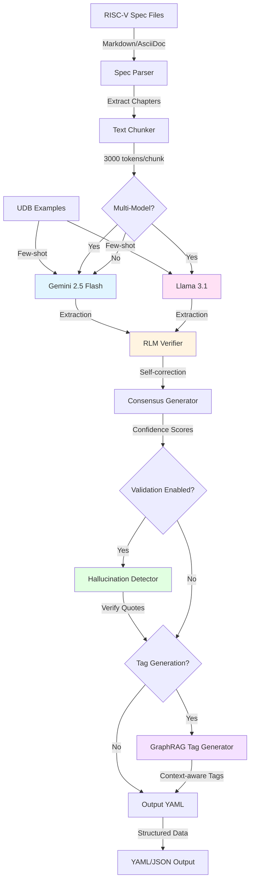
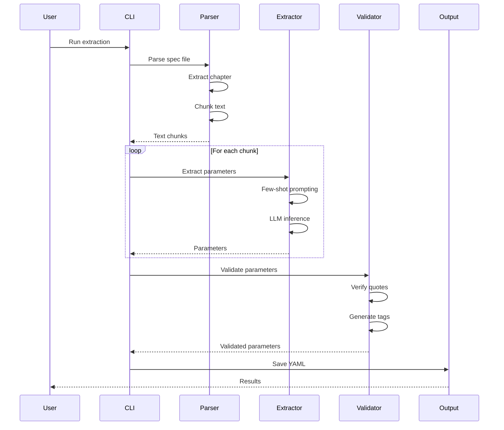
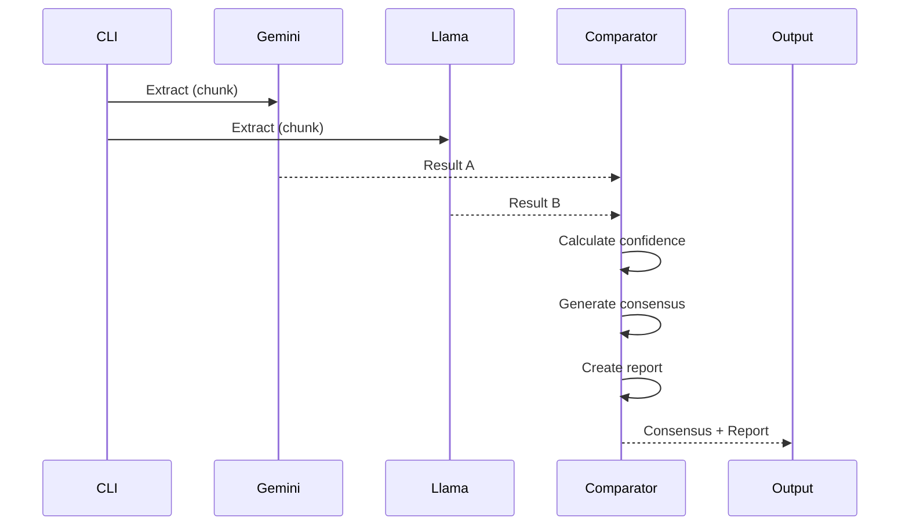

# Architecture Documentation

## System Overview

The RISC-V Parameter Extractor is a production-grade agentic pipeline that transforms natural language RISC-V specifications into machine-readable YAML parameters. The system leverages LLMs with multi-model consensus, hallucination detection, and comprehensive validation.

## Architecture Diagram



## Component Architecture

### 1. Parsing Layer

**Components:**
- `RISCVSpecParser`: Markdown/AsciiDoc parsing
- `TextChunker`: Intelligent chunking with overlap

**Responsibilities:**
- Extract chapters from spec files
- Chunk text for LLM processing
- Preserve context across chunks

**Key Features:**
- Format detection (Markdown/AsciiDoc)
- Chapter extraction with metadata
- Token-aware chunking

---

### 2. Extraction Layer

**Components:**
- `RISCVArchitecturalMiner`: DSPy signature for extraction
- `ModelComparator`: Multi-model consensus
- `RLMVerifier`: Recursive self-correction

**Responsibilities:**
- Extract parameters from text
- Compare multiple model outputs
- Generate confidence scores

**Key Features:**
- Few-shot prompting with UDB examples
- Multi-model consensus (Gemini + Llama)
- Confidence scoring (HIGH/MEDIUM/LOW)

---

### 3. Validation Layer

**Components:**
- `HallucinationDetector`: Source quote verification
- `TagGenerator`: GraphRAG-based naming
- `UDBValidator`: Schema validation (future)

**Responsibilities:**
- Verify extracted parameters
- Generate unique tags
- Validate against UDB schema

**Key Features:**
- Exact and fuzzy quote matching
- Suspicious pattern detection
- Context-aware tag generation

---

### 4. Configuration Layer

**Components:**
- `Config`: Pydantic-based settings
- `Logger`: Rich-formatted logging
- `Environment`: API key management

**Responsibilities:**
- Centralized configuration
- Structured logging
- Secret management

**Key Features:**
- YAML configuration
- Type-safe settings
- Environment variable support

---

## Data Flow

### Single-Model Extraction



### Multi-Model Extraction



---

## Module Structure

```
src/
├── agents/
│   └── signatures.py          # DSPy signatures
├── comparators/
│   └── model_comparator.py    # Multi-model comparison
├── config/
│   └── settings.py            # Configuration management
├── generators/
│   └── tag_generator.py       # GraphRAG tag generation
├── loaders/
│   └── udb_loader.py          # UDB examples loading
├── models/
│   └── schema.py              # Pydantic models
├── parsers/
│   └── spec_parser.py         # Spec file parsing
├── utils/
│   └── logger.py              # Logging system
├── validators/
│   └── hallucination_detector.py  # Quote verification
└── main.py                    # CLI entry point
```

---

## Configuration

### YAML Configuration (`config.yaml`)

```yaml
models:
  primary: "gemini/gemini-2.5-flash"
  temperature: 0.0
  max_tokens: 4000

extraction:
  chunk_size: 3000
  overlap: 200
  num_examples: 12

validation:
  similarity_threshold: 0.85
  enable_hallucination_detection: false

logging:
  level: "INFO"
  format: "rich"
```

### Environment Variables

```bash
GEMINI_API_KEY=your_api_key_here
```

---

## Deployment

### Docker

```bash
# Build image
docker build -t riscv-param-extractor .

# Run extraction
docker run -v $(pwd)/specs:/app/specs \
           -v $(pwd)/outputs:/app/outputs \
           -e GEMINI_API_KEY=$GEMINI_API_KEY \
           riscv-param-extractor \
           python -m src.main --spec-path /app/specs/riscv-privileged.md --chapter 3
```

### Docker Compose

```bash
# Start services
docker-compose up

# With Ollama for multi-model
docker-compose up extractor ollama
```

---

## Performance Characteristics

### Benchmarks

- **Parsing**: 14.2K ops/sec (70.4 μs/op)
- **Chunking**: 2.2M ops/sec (0.45 μs/op)

### Scalability

- **Chunk Processing**: Parallel-ready (currently sequential)
- **Multi-Model**: Concurrent API calls
- **Memory**: O(n) where n = spec file size

---

## Testing Strategy

### Test Pyramid

```
        /\
       /  \      Integration Tests (10)
      /____\
     /      \    Unit Tests (71)
    /________\
```

### Coverage

- **Overall**: 68%
- **Critical Modules**: 93-100%
- **Integration**: End-to-end pipeline

---

## Future Enhancements

1. **Parallel Processing**: Process chunks concurrently
2. **Caching**: Cache LLM responses
3. **Streaming**: Stream results for large specs
4. **Web UI**: Browser-based interface
5. **API Server**: REST API for integration

---

## References

- [DSPy Documentation](https://github.com/stanfordnlp/dspy)
- [RISC-V Specifications](https://riscv.org/technical/specifications/)
- [Pydantic Documentation](https://docs.pydantic.dev/)
